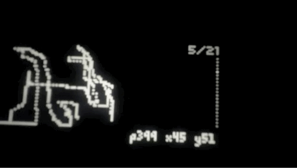

# norns-canvas
 WIP - pixel art for norns

## controls:
- v0.0.2
- e2: move cursor x
- e3: move cursor y
- k2: place pixels (press/hold)
- k3: remove pixels (press/hold)
- k3+k2: take screenshot 
- k1+k3: clear screen
- screenshots are saved in /dust/data/norns-canvas

## to-do:
#### norns-canvas
- [ ] optimize drawing (try to prevent as many "warning: screen event Q full!" errors/glitches)
- [ ] extend (these may not be possible)
  - [ ] copy/paste
  - [ ] keyboard control (3 keys are not enough) 
  - [ ] inport png / collage
  - [ ] audio output / input (hmmm...)
- [ ] param to purge /data/norns-canvas/ screenshot folder (maybe not if i can work in editing to gallery script)
- [ ] make pixel/xy info display a param (on/off
- [ ] make screenshot type/size a param option (see screenshot docs)
- [ ] save screenshots to /data/norns-canvas/png or fix gallery to not try to display folders from inside data folder (galleryxy, norns-gallery, etc) - these seem to repopulate 
#### norns-gallery
- [ ] option to hide display info
- [ ] save settings/galleries as params so psets work
- [ ] add option to delete images

## archive
- gallery: add "no images in gallery dir" splash screen
- gallery: create default gallery dir if it doesn't exist
- gallery: add multiple directory support k3 to add dir and k2 to switch between dir
- update norns-canvas screenshot dir
- (started) another script idea -> a gallery to display canvas screenshots (see galleryXY.lua) and norns-gallery
- 2d array for pixels
- remove filename display
- started gallery script
- change screenshot to non-upscaled -> [norns screenshot docs](https://monome.org/docs/norns/help/data/#png)
- add wip screenshot
- k1+k3 clear screen
- multiple delete (hold k3)
- update date+time after a screenshot is taken
- date+time screenshot filename
- screenshot function
- add pixel count
- visible cursor
- single/multiple draw (tap/hold k2)