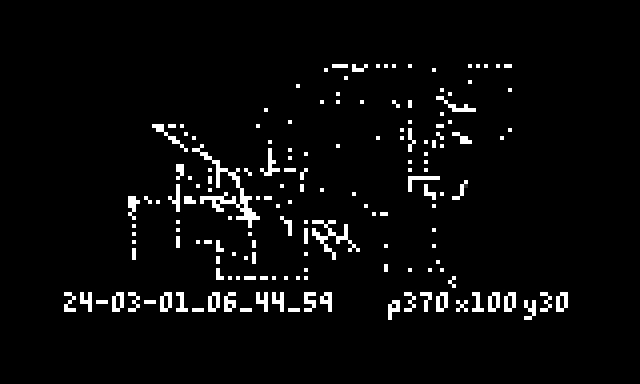

# norns-canvas
 WIP - pixel art for norns

## controls:
- v0.0.1
- e2: move cursor x
- e3: move cursor y
- k2: place pixels (press/hold)
- k3: remove pixels (press/hold)
- k3+k2: take screenshot 
- k1+k3: clear screen

## to-do:
- [ ] optimize drawing (try to prevent as many "warning: screen event Q full!" errors/glitches)
- [ ] extend (these may not be possible)
  - [ ] copy/paste
  - [ ] keyboard control (3 keys are not enough) 
  - [ ] inport png / collage
  - [ ] another script idea, but a gallery to display canvas screenshots, could build the basic functionality in a second page of this script
  - [ ] audio output / input (hmmm...)
  - [ ] param to purge /data/norns-canvas/ folder 

## archive
- add wip screenshot
- k1+k3 clear screen
- multiple delete
- update date+time after a screenshot is taken
- date+time screenshot filename
- screenshot function
- add pixel count
- visible cursor
- single/multiple draw
